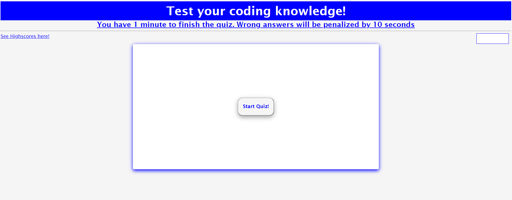
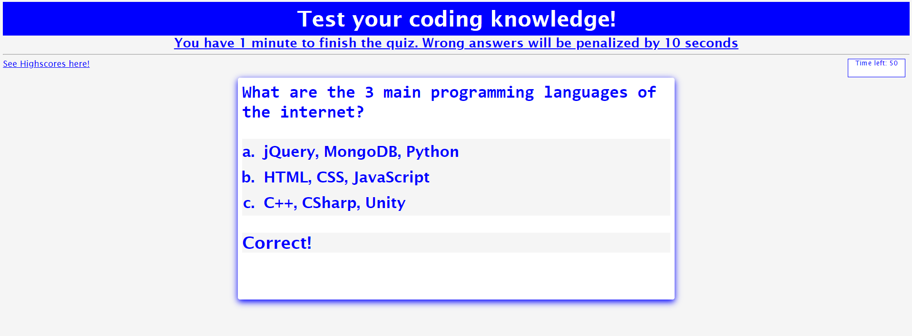
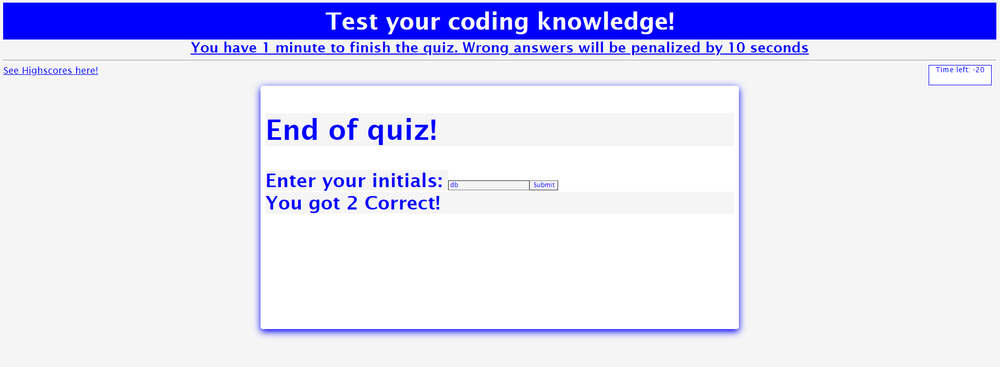
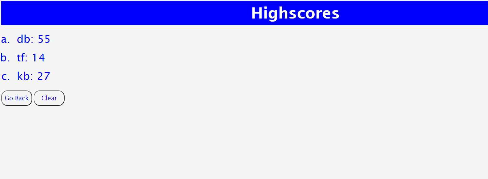

# Coding Quiz

* This application is a quiz with topics related to coding. You have 60 seconds to answer 5 questions and each wrong answer deducts your time by 15 seconds. At the end of the quiz your score is displayed and saved to the highscores presented on the highscores page.

 

## Built With

* [HTML](https://developer.mozilla.org/en-US/docs/Web/HTML)
* [CSS](https://developer.mozilla.org/en-US/docs/Web/CSS)
* [Javascript](https://developer.mozilla.org/en-US/docs/Web/JavaScript)

## Deployed Link

* [Test your coding knowledge!](https://derekbanister.github.io/code-quiz/)

## Authors

* **DEREK BANISTER** 

- [Link to Portfolio Site](https://derekbanister.github.io/First-Portfolio/)
- [Link to Github](https://github.com/DerekBanister)
- [Link to LinkedIn](https://www.linkedin.com/in/derek-banister/)
